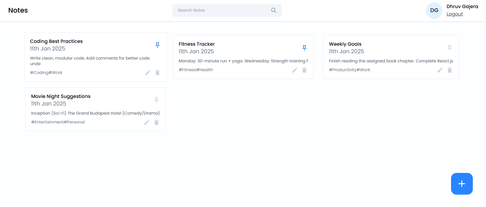

# Notes App 📋 (MERN Stack)

A feature-rich, full-stack **Notes Application** built using the **MERN stack** (MongoDB, Express.js, React.js with Vite, and Node.js). This app allows users to manage their notes seamlessly with functionalities like authentication, note pinning, searching, and more.



---

## 🚀 Features

### 🖥️ Frontend

- **Framework:** Built with **React.js** powered by **Vite** for blazing-fast development.
- **Styling:** Responsive and modern UI designed with **Tailwind CSS**.
- **State Management:** Uses React hooks for efficient state handling.
- **API Communication:** Seamless data fetching with **Axios**.

#### Key Pages:
- **Login:** Secure JWT-based user authentication.
- **Signup:** Quick user registration.
- **Dashboard:** Displays all user notes with features to **search**, **pin**, **edit**, and **delete** notes.
- **Add/Edit Note:** Intuitive interface for creating and modifying notes.

### 🌐 Backend

- **Server:** Developed using **Node.js** and **Express.js**.
- **Database:** **MongoDB** for flexible, scalable data storage.
- **Security:** Implements **JWT** for secure authentication and authorization.
- **RESTful APIs:** Clean, modular endpoints for user management and note operations.

### 📄 Swagger UI Integration

- Integrated **Swagger UI** for interactive API documentation.
- Access API docs at: [http://localhost:8002/api-docs](http://localhost:8002/api-docs) *(after starting the backend)*

---

## ⚙️ Installation & Setup

### Prerequisites

- **Node.js** (v14 or higher)
- **MongoDB** (local or cloud instance)
- **npm** or **Yarn**

### Backend Setup

1. **Navigate to the backend directory:**
   ```bash
   cd backend
   ```
2. **Install dependencies:**
   ```bash
   npm install
   ```
3. **Environment Configuration:**
   Create a `.env` file in the root directory:
   ```env
   MONGO_URI=your_mongodb_connection_string
   JWT_SECRET=your_secret_key
   PORT=8002
   ```
4. **Start the backend server:**
   ```bash
   npm start
   ```
   - Server runs at: [http://localhost:8002](http://localhost:8002)
   - API Docs: [http://localhost:8002/api-docs](http://localhost:8002/api-docs)

### Frontend Setup

1. **Navigate to the frontend directory:**
   ```bash
   cd frontend
   ```
2. **Install dependencies:**
   ```bash
   npm install
   ```
3. **Start the development server:**
   ```bash
   npm run dev
   ```
   - App runs at: [http://localhost:5173](http://localhost:5173)

---

## 📡 API Endpoints

### 🔐 Authentication
- `POST /create-account` - Register a new user.
- `POST /login` - Authenticate user and return JWT.
- `GET /get-user` - Retrieve authenticated user data.

### 📝 Notes Management
- `POST /add-note` - Add a new note.
- `GET /get-all-notes` - Fetch all notes for a user.
- `PUT /edit-note/:noteId` - Edit an existing note.
- `DELETE /delete-note/:noteId` - Delete a note.
- `PUT /update-note-pinned/:noteId` - Pin/Unpin a note.
- `GET /search-note` - Search notes by keyword.

---

## 🚀 Future Improvements

- **Rich Text Editor:** Enhance note-taking with formatting options.
- **Collaboration:** Share notes with others in real-time.
- **Offline Mode:** Enable functionality without an internet connection using service workers.

---

## 📬 Contact

For any questions or feedback:
- **Email:** [dhruvgajera05@gmail.com](mailto:dhruvgajera05@gmail.com)

---

> **Made with ❤️ using the MERN Stack**

